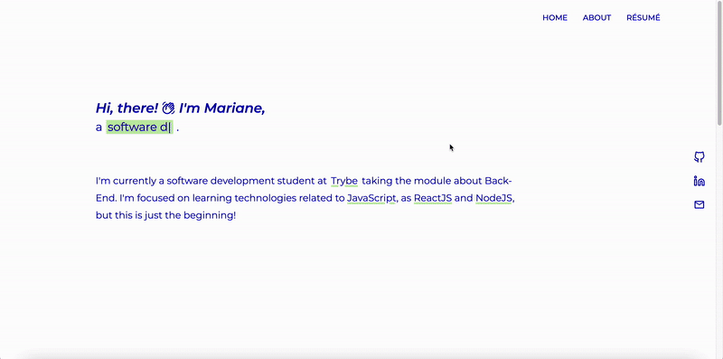
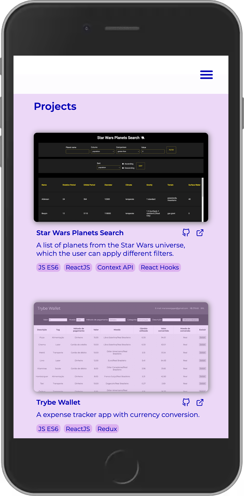
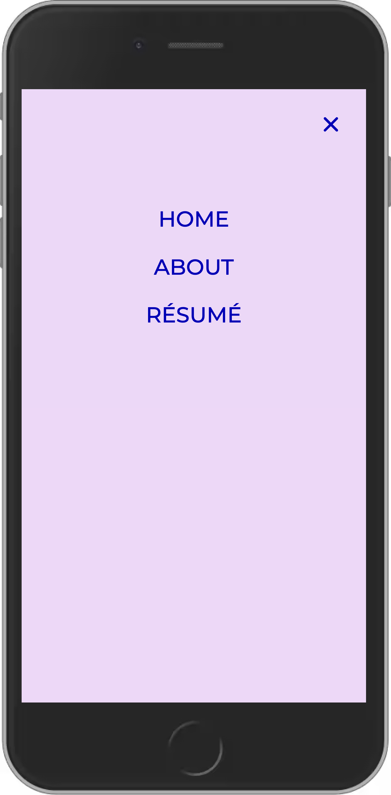

# My Portfolio



My personal website with a list of my projects.

## Technologies

HTML, JavaScript, ReactJS, React Router, React Hooks, Styled Components.

## How to download and run the project

- Clone the repository:

```
    git clone git@github.com:MarianeAlgayer/MarianeAlgayer.github.io.git
```

- Navigate into the project directory:

```
    cd MarianeAlgayer.github.io.git/portfolio
```

- Install dependencies:

```
    npm install
```

- Run the project:

```
    npm start
```

<p align="center">
  
  &nbsp&nbsp&nbsp&nbsp&nbsp
  
</p>

## Deploy

You can also access the project here: [deploy link](https://marianealgayer.github.io/).

